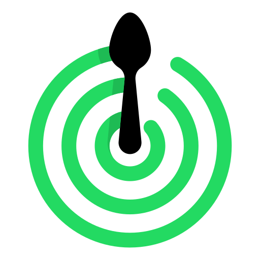
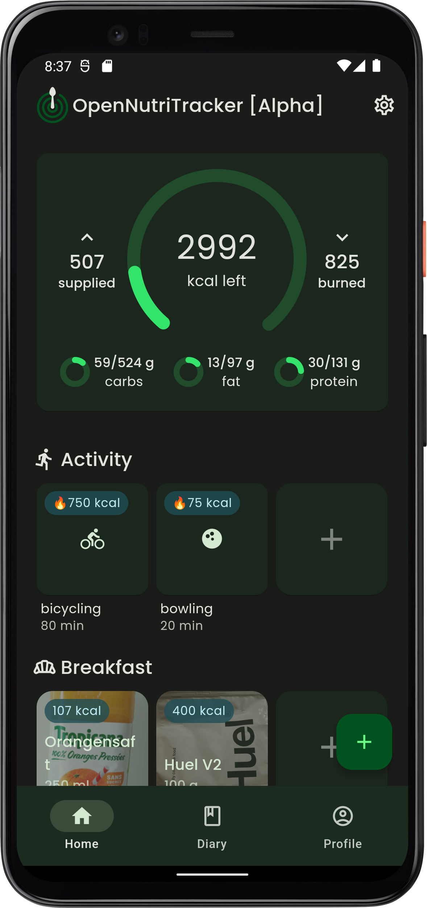
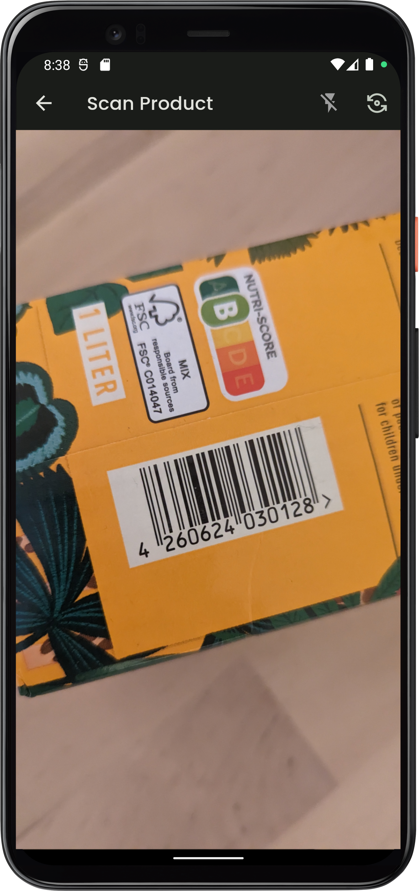
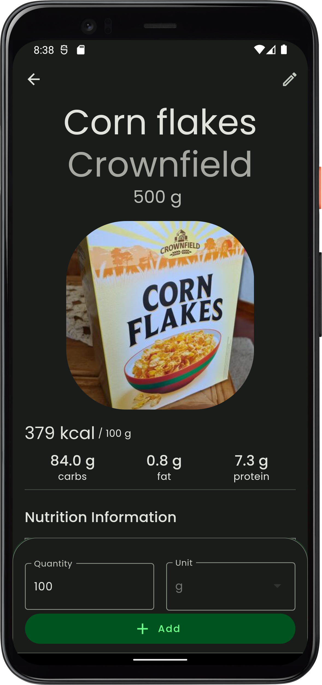
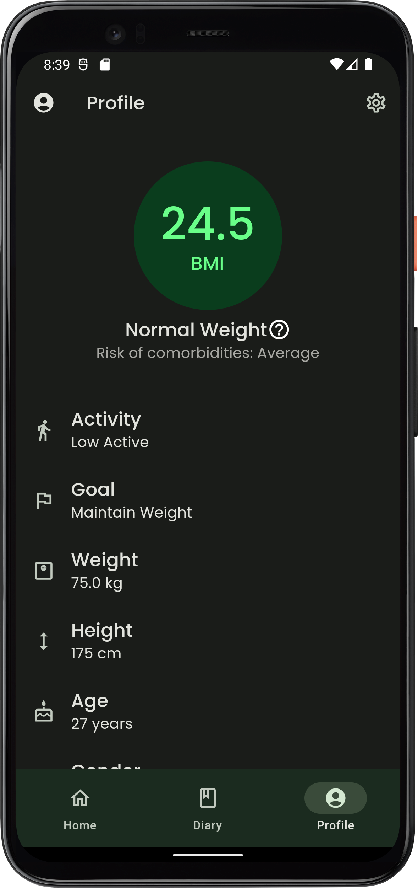

  
  <h1 align="center">OpenNutriTracker</h1>

  
  
  
  
  

## Description
OpenNutriTracker is an open-source mobile application designed to simplify nutritional tracking and management. Whether you are looking to improve your health, lose weight, or simply maintain a balanced diet, OpenNutriTracker provides a minimalistic interface to easily track and analyze your daily nutrition.

[Website](https://simonoppowa.github.io/OpenNutriTracker-Website/)

## Screenshots

  
  &nbsp;&nbsp;
  
  &nbsp;&nbsp;
  
  &nbsp;&nbsp;
  

## Install

## Key Features
- **🍎 Nutritional Tracking:** Easily log your meals and snacks, and access a vast database of food items and ingredients to get detailed nutritional information.
- **📓 Food Diary:** Maintain a comprehensive food diary to keep track of your daily food consumption, habits, and progress.
- **🍽️ Custom Meals:** Plan your meals in advance, create personalized meal plans, and optimize them according to your dietary goals.
- **📷 Barcode Scanner:** Scan barcodes on packaged food items to instantly retrieve their nutritional information.
- **🔒 Privacy Focused:** OpenNutriTracker prioritizes the privacy its users. It does not collect or share any personal data without your consent.
- **🚫💰 No Subscription, In-App Purchases, or Ads:** OpenNutriTracker is completely free to use, without any subscription fees, in-app purchases, or intrusive advertisements.

## Privacy
See [Data Protection](https://www.iubenda.com/privacy-policy/53501884)
- **Data Encryption**: All collected user data is encrypted and stored locally on your device
- **Minimal Data Collection**: OpenNutriTracker only collects the necessary information required for tracking nutrition and providing personalized insights. Your data will not be shared with third parties without your consent.
- **Open-Source**: OpenNutriTracker is an open-source application

## TODOs
- Add serving sizes to meals
- Add Imperial unit support
- Add support for Material You themes

## Contribution
Contributions to OpenNutriTracker are welcome! If you find any issues or have suggestions for new features, please open an issue or submit a pull request. Make sure to follow the project's code style and guidelines.

## Disclaimer
OpenNutriTracker is not a medical application. All data provided is not validated and should be used with caution. Please maintain a healthy lifestyle and consult a professional if you have any problems. Use during illness, pregnancy or lactation is not recommended.

The application is still under construction. Errors, bugs and crashes might occur.

## Acknowledgments
The OpenNutriTracker project was inspired by the need for a simple and effective nutrition tracking tool.
The food database used in OpenNutriTracker is powered by [Open Food Facts](https://world.openfoodfacts.org/) and [Food Data Central](https://fdc.nal.usda.gov/).

## License
This project is licensed under the GNU General Public License v3.0 License. See the [LICENSE](LICENSE) file for more information.

## Contact
For questions, suggestions, or collaborations, feel free to contact the project maintainer:

Simon Oppowa

- GitHub: [@simonoppowa](https://github.com/simonoppowa)
- Email: [opennutritracker-dev@pm.me](mailto:opennutritracker-dev@pm.me)
