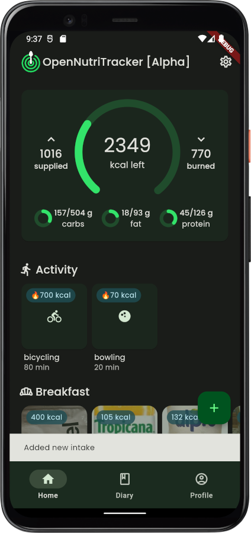
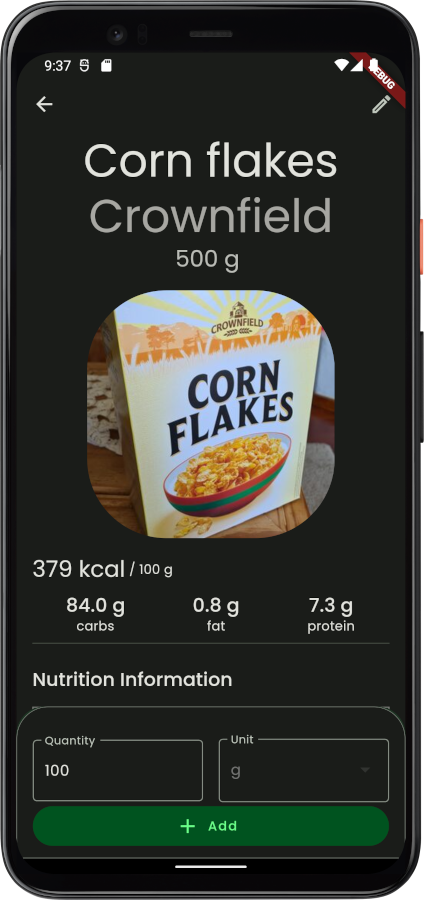
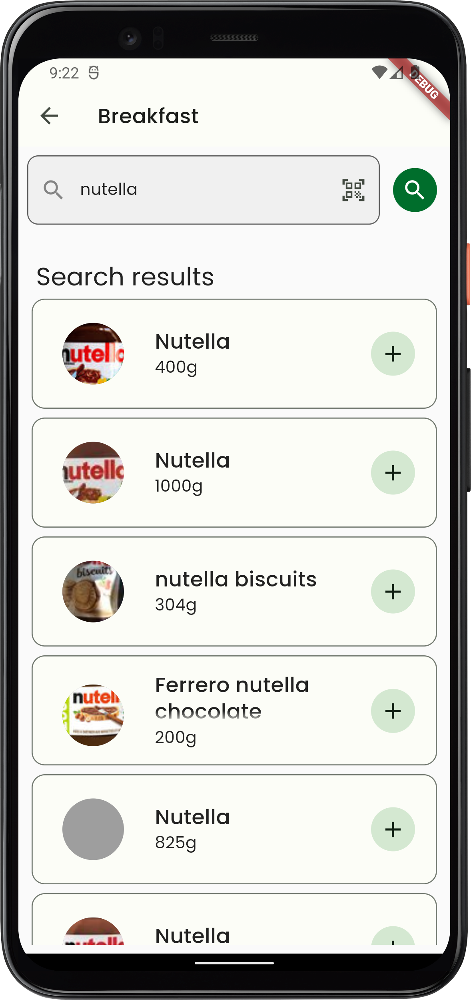
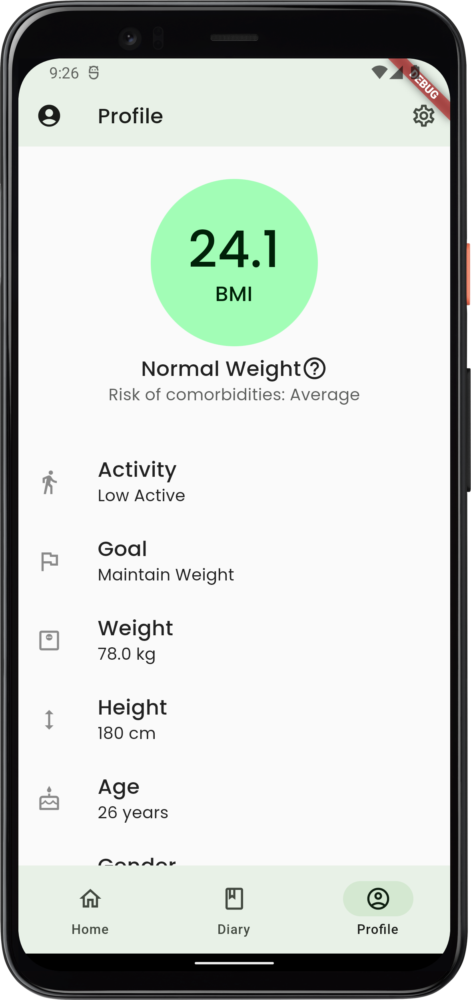

  
  <h1 align="center">OpenNutriTracker</h1>

## Description
OpenNutriTracker is an open-source iOS/Android application designed to help users track their nutrition intake and monitor their dietary habits. Whether you are looking to improve your health, lose weight, or simply maintain a balanced diet, OpenNutriTracker provides a minimalistic interface to easily track and analyze your daily nutrition.

## Screenshots

  
  &nbsp;&nbsp; 
  
  &nbsp;&nbsp; 
  
  &nbsp;&nbsp; 
  

## Features
- **Daily overview**
- **Diary**
- **Product or meal search**
- **Barcode scanner**
- **Create custom meal itemts**
- **No ads, subscriptions or in-app purchases**

## Privacy
- **Data Encryption**: All collected user data is encrypted and stored locally on your device
- **Minimal Data Collection**: OpenNutriTracker only collects the necessary information required for tracking nutrition and providing personalized insights. Your data will not be shared with third parties without your consent.
- **Open-Source**: OpenNutriTracker is an open-source application

See [Data Protection](https://www.iubenda.com/privacy-policy/53922100)

## TODOs
- Add serving sizes to meals
- Add Imperial unit support
- Add support for Material You themes

## Contribution
Contributions to OpenNutriTracker are welcome! If you find any issues or have suggestions for new features, please open an issue or submit a pull request. Make sure to follow the project's code style and guidelines.

## Disclaimer
OpenNutriTracker is not a medical application. All data provided is not validated and should be used with caution. Please maintain a healthy lifestyle and consult a professional if you have any problems. Use during illness, pregnancy or lactation is not recommended.

The application is still under construction. Errors, bugs and crashes might occur.

## Acknowledgments
The OpenNutriTracker project was inspired by the need for a simple and effective nutrition tracking tool.
The food database used in OpenNutriTracker is powered by [Open Food Facts](https://world.openfoodfacts.org/) and [Food Data Central](https://fdc.nal.usda.gov/).

## License
This project is licensed under the GNU General Public License v3.0 License. See the [LICENSE](LICENSE) file for more information.

## Contact
For questions, suggestions, or collaborations, feel free to contact the project maintainer:

Simon Oppowa

- GitHub: [@simonoppowa](https://github.com/simonoppowa)
- Email: [opennutritracker-dev@pm.me](mailto:opennutritracker-dev@pm.me)
