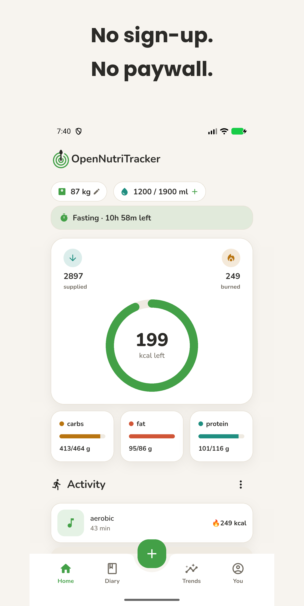
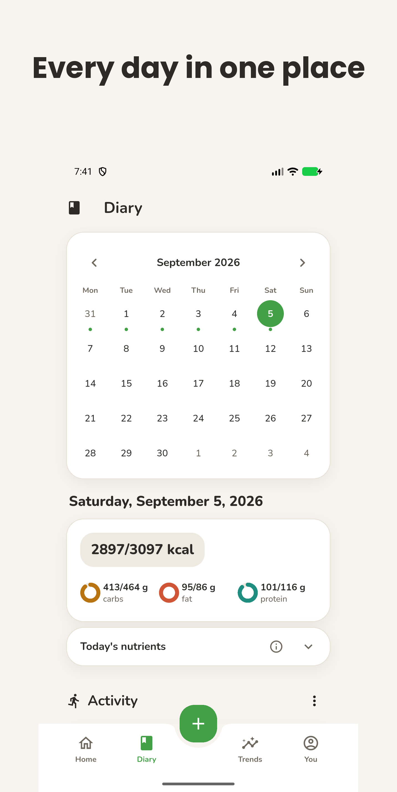
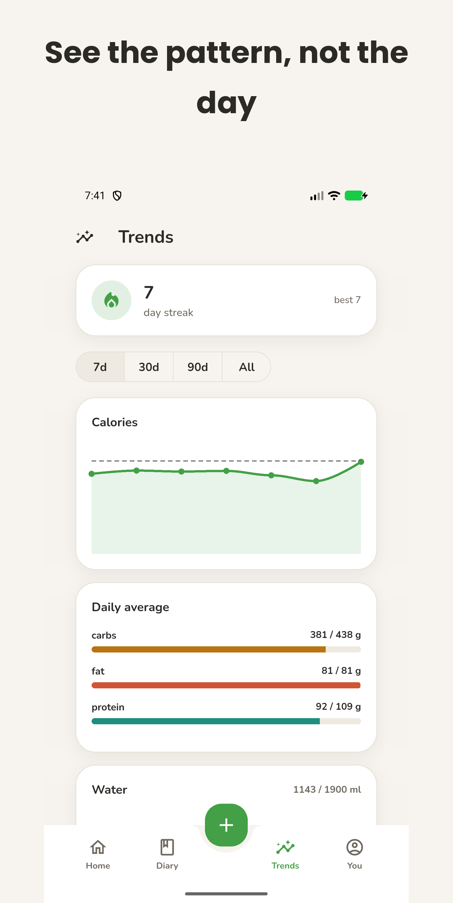
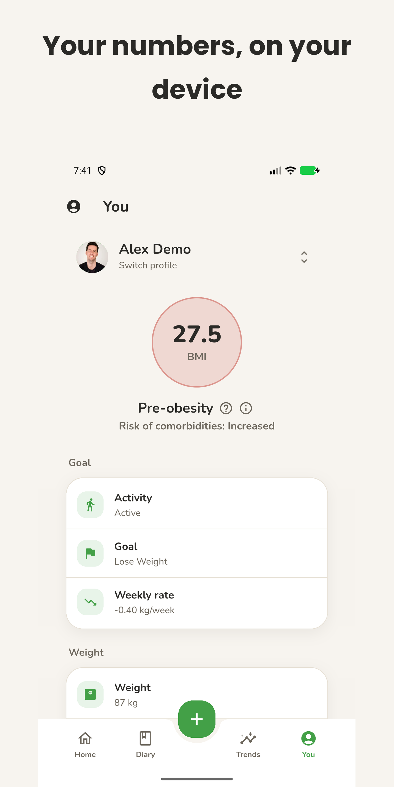

<p align="center">
  <picture>
    <source media="(prefers-color-scheme: dark)" srcset="assets/icon/ont_banner_top_light.png">
    
  </picture>
</p>

<p align="center">
  <b>Nutrition tracking that stays on your phone.</b><br />
  Open-source calorie and micronutrient logging — no account, no subscription, no ads.
</p>

<p align="center">
  <a href="LICENSE"></a>
  <a href="https://github.com/simonoppowa/OpenNutriTracker/releases"></a>
  <a href="https://github.com/simonoppowa/OpenNutriTracker/actions/workflows/default_workflow.yml"></a>
  
  <a href="https://hosted.weblate.org/engage/opennutritracker/"></a>
  <a href="https://github.com/simonoppowa/OpenNutriTracker/stargazers"></a>
  <a href="https://github.com/simonoppowa/OpenNutriTracker/issues"></a>
  <a href="https://github.com/simonoppowa/OpenNutriTracker/pulls"></a>
</p>

<p align="center">
  <a href="https://trendshift.io/repositories/12625"></a>
  &nbsp;
  <a href="https://trendshift.io/repositories/12625"></a>
</p>

<p align="center">
  <a href="https://simonoppowa.github.io/OpenNutriTracker/">Website</a>
  ·
  <a href="GettingStarted.md">Getting started</a>
  ·
  <a href="CONTRIBUTING.md">Contributing</a>
  ·
  <a href="https://hosted.weblate.org/engage/opennutritracker/">Translate</a>
</p>

OpenNutriTracker is an open-source mobile application designed to simplify nutritional
tracking and management. Whether you are looking to improve your health, lose weight, or
simply maintain a balanced diet, OpenNutriTracker provides a minimalistic interface to
easily track and analyze your daily nutrition.

## Install

<p align="center">
  <a href="https://apps.apple.com/us/app/opennutritracker/id6451490901"></a>
  &nbsp;&nbsp;
  <a href="https://play.google.com/store/apps/details?id=com.opennutritracker.ont.opennutritracker"></a>
</p>

## Screenshots

<table align="center">
  <tr>
    <td align="center" width="25%"></td>
    <td align="center" width="25%"></td>
    <td align="center" width="25%"></td>
    <td align="center" width="25%"></td>
  </tr>
  <tr>
    <td align="center"><sub><b>Home</b></sub></td>
    <td align="center"><sub><b>Barcode scanner</b></sub></td>
    <td align="center"><sub><b>Food details</b></sub></td>
    <td align="center"><sub><b>Profile</b></sub></td>
  </tr>
</table>

## Key features

|  | Feature | |
| :--: | :-- | :-- |
| 🍎 | **Food logging** | Search, scan a barcode, or quick-add kcal — backed by Open Food Facts, USDA, and German BLS. |
| 📓 | **Food diary** | Breakfast, Lunch, Dinner, and Snack on a calendar, with per-meal kcal targets. |
| 🥕 | **Micronutrients** | Day and week views for ten nutrients, with optional reference-intake bars. |
| 🍽️ | **Meals and recipes** | Reusable recipes with photo, brand, and barcode. |
| 🏃 | **Activities and weight** | Workout catalogue or custom activities; weight trend against a target. |
| 💧 | **Water and fasting** | A home-screen water chip and an optional intermittent-fasting timer. |
| 🎨 | **Themes and units** | Material You accent on Android 12+, sixteen built-in themes, kcal or kJ. |
| 📤 | **Export and import** | JSON and CSV export, JSON import, and QR sharing. |
| 🔒 | **Private and free** | Encrypted local storage, opt-in crash reports, no ads or subscriptions. |

<details>
<summary>More detail on each feature</summary>

- **🍎 Nutritional tracking:** Log meals and snacks against a large food database — Open Food Facts plus a multi-source reference backend covering USDA FoodData Central and the German Bundeslebensmittelschlüssel (BLS), with the sources selectable in Settings → Food databases. Each entry can be searched, scanned, or added straight as a number when you already know the calorie cost.
- **📓 Food diary:** A calendar-driven diary that breaks the day into Breakfast, Lunch, Dinner, and Snack, with per-meal kcal targets (Standard, OMAD, Five-small, Mediterranean, Two-meal, or a custom share), drag-to-rearrange between meals, and sort by time or by macro contribution.
- **🥕 Micronutrient panel:** Day and week views for fibre, sodium, saturated fat, sugar, calcium, iron, potassium, vitamin D, vitamin B12, and magnesium, with optional Dietary Reference Intake bars from the IOM tables so you can see where you sit against the reference range.
- **🍽️ Custom meals + recipes:** Build a one-off custom meal or save a reusable recipe with photo, brand, and barcode. The recipe builder has its own ingredient picker with barcode scanning so you can compose meals from real products without leaving the screen.
- **⚡ Quick add:** When you already know roughly how much you ate, skip the search flow entirely — Quick add takes a title plus kcal (and optional macros) and logs it straight to the meal section.
- **📷 Barcode scanner:** Scan packaged items for instant lookup, paste a barcode manually when the camera struggles, or attach a barcode to a custom meal so future scans recognise your own foods.
- **🏃 Activities:** Log workouts from a categorised activity catalogue or define your own custom activities with direct kcal entry and reusable templates.
- **💧 Water tracker:** A water chip on the home screen with quick-add increments, an editable goal, and undo for the last entry.
- **⏱️ Fasting timer:** Optional intermittent-fasting timer with content-warning gate, a home chip showing time remaining, and a completion notification when you reach your window.
- **⚖️ Weight history:** Capture weight during onboarding and on demand, see the trend on a chart with a dashed line at your target weight, and optionally taper the calorie goal as you approach it.
- **🎨 Material You + theme picker:** Adopt the system accent colour on Android 12+, or pick from sixteen built-in presets. The app icon adapts to iOS dark and tinted appearances and to Android themed icons.
- **🔢 kcal or kJ:** Switch the energy unit globally; every diary entry, target, and chart reflects the choice.
- **📤 Export and import:** Export your full diary, activities, and custom catalogue to a JSON zip or CSV, paste a JSON blob to import meals, and share a single meal or activity as a QR code another phone can scan.
- **🔒 Privacy first:** All data is AES-encrypted and stored locally. Anonymous crash reporting is opt-in during onboarding, can be turned off at any time, and the App Store privacy manifest declares exactly what the app does and does not collect.
- **🚫💰 No subscriptions, in-app purchases, or ads:** OpenNutriTracker is free, with no paid tier and no advertising.

</details>

## Privacy

There is no account and no sign-in, no analytics SDK, and no advertising SDK. Everything you log is written to an encrypted database on your device and stays there. The formal policy is [Data Protection](https://www.iubenda.com/privacy-policy/53501884); this section describes what the code actually does.

### Stored on your device

Your profile, diary, activities, weight log, water and fasting history, custom meals, and recipes live in local [Hive](https://pub.dev/packages/hive_ce) boxes encrypted with **AES-256**.

The 32-byte key is generated with a secure RNG on first launch and kept in platform secure storage — the Android Keystore and the iOS Keychain — via [`flutter_secure_storage`](https://pub.dev/packages/flutter_secure_storage). It is never written into the database and never transmitted. See [`secure_app_storage_provider.dart`](lib/core/utils/secure_app_storage_provider.dart).

**Settings → Delete all my data** clears the active profile's boxes and returns the app to onboarding.

### Leaves your device

Only these four destinations are ever contacted, and only for the reason listed:

| Destination | When | What is sent |
| :-- | :-- | :-- |
| [Open Food Facts](https://world.openfoodfacts.org/) | You search for a food or scan a barcode | The search term or barcode, plus a country tag derived from your device locale so locally sold products rank higher |
| [USDA FoodData Central](https://fdc.nal.usda.gov/) (`api.nal.usda.gov`) | You search for a food | The search term and the app's API key |
| Supabase reference backend | You search for a food, when that source is enabled | The search term |
| [Sentry](https://sentry.io) | **Only if you opt in** | Crash stack traces, app version, OS version, device model |

Requests carry a User-Agent naming the app, platform, and version — no user or device identifier is attached. Remote search results are cached locally and pruned after 90 days.

### Crash reporting is opt-in

Crash reporting is off unless you turn it on, and it is offered during onboarding rather than assumed. Concretely:

- It initializes only when consent was given **and** the build is a release build ([`main.dart:119`](lib/main.dart:119)) — debug and profile builds never report.
- Sentry's `sendDefaultPii` is left at its default of `false`, so events carry no username, email, or IP-derived identity.
- Turning it off in Settings closes the SDK immediately, and **Delete all my data** closes it before wiping.
- If the local database fails an integrity check at startup, diagnostics stay local — consent lives inside the encrypted box, so nothing is reported before it can be read ([`main.dart:59-71`](lib/main.dart:59)).

### Permissions

| Permission | Why |
| :-- | :-- |
| Camera | Barcode scanning, and photographing a custom meal |
| Photo library | Attaching a meal photo, and saving an export |
| Notifications | Daily reminder and fasting-window completion |
| Internet | Food database lookups |
| Receive boot completed | Re-registers the daily reminder after a reboot |

No location, contacts, microphone, or platform health-data access is requested.

### Not collected

- No account, email address, or phone number — the Supabase backend is read with an anonymous key and the app contains no sign-in path.
- No advertising identifier and no cross-app tracking. The iOS privacy manifest declares `NSPrivacyTracking` as `false` with an empty tracking-domains list, and reports crash and performance data as *not linked to the user* ([`PrivacyInfo.xcprivacy`](ios/Runner/PrivacyInfo.xcprivacy)).
- No ads, and no third-party ad or attribution SDKs.

<details>
<summary><b>Verifying APK signatures</b></summary>

If you are side-loading an OpenNutriTracker APK from GitHub Releases — or from F-Droid, once the app is published there — you may reasonably want to confirm that the file you downloaded was signed by the same key the maintainer uses for every release, rather than by someone who intercepted the download or repackaged the app. The check below is for anyone who would like that extra reassurance before installing.

The official SHA256 fingerprint of the Android release signing certificate is:

```
SHA256: 84:E8:60:74:EC:7E:DA:BB:10:F2:01:79:86:DD:F0:9E:53:1C:AF:7A:73:08:0A:C1:17:2B:80:C4:9C:62:08:27
```

To verify a downloaded APK against that fingerprint, run:

```sh
apksigner verify --print-certs /path/to/opennutritracker.apk
```

The `SHA-256` line in the output should match the value above exactly.

</details>

## Translations

OpenNutriTracker is translated on [Hosted Weblate](https://hosted.weblate.org/engage/opennutritracker/). Translating needs no local setup and no Dart — pick a language, edit the strings in the browser, and Weblate syncs the result back to this repository.

<p align="center">
  <a href="https://hosted.weblate.org/engage/opennutritracker/"></a>
</p>

To start a language that isn't listed yet, request it from the [Weblate project page](https://hosted.weblate.org/projects/opennutritracker/). If you would rather work in the repository directly, the source strings live in [`lib/l10n/intl_en.arb`](lib/l10n/intl_en.arb) — see [CONTRIBUTING.md](CONTRIBUTING.md) for the conventions.

## Contributing

Contributions to OpenNutriTracker are welcome! If you find any issues or have suggestions for new features, please open an issue or submit a pull request. See [CONTRIBUTING.md](CONTRIBUTING.md) for the project's conventions — including the requirement to target the `develop` branch and the steps for adding localized strings.

Built with **Flutter** and **Dart**, following a clean-architecture split (data / domain / presentation) with `flutter_bloc` for state, `get_it` for dependency injection, and encrypted `hive_ce` boxes for local storage. [AGENTS.md](AGENTS.md) is the full architecture and conventions reference.

**Getting started:** see [GettingStarted.md](GettingStarted.md) for setting up a local build.

**Data export format:** the export bundle (Settings → Export / Import App Data → Export) is documented at [`docs/export-format.md`](docs/export-format.md) — both the JSON schema and the CSV companion the import / export round-trip uses.

**Food database backend:** the multi-source food database lives in its own repository, [OpenNutriTracker-Backend](https://github.com/simonoppowa/OpenNutriTracker-Backend) — schema, import pipeline, and translation tooling. Self-hosting it and pointing a local build at your own Supabase project is documented at [`docs/supabase-self-hosting.md`](docs/supabase-self-hosting.md).

Thanks to all the contributors:

<a href="https://github.com/simonoppowa/OpenNutriTracker/graphs/contributors">

</a>

## Disclaimer

> [!WARNING]
> OpenNutriTracker is not a medical application. All data provided is not validated and
> should be used with caution. Please maintain a healthy lifestyle and consult a
> professional if you have any problems. Use during illness, pregnancy or lactation is
> not recommended.

> [!NOTE]
> The application is still under construction. Errors, bugs and crashes might occur.

## Acknowledgments

The OpenNutriTracker project was inspired by the need for a simple and effective nutrition tracking tool.

The food database used in OpenNutriTracker is powered by [Open Food Facts](https://world.openfoodfacts.org/) together with a multi-source reference backend hosted in Supabase: [USDA FoodData Central](https://fdc.nal.usda.gov/) (CC0) and the [Bundeslebensmittelschlüssel](https://www.blsdb.de) 4.0 (CC BY 4.0, © Max Rubner-Institut), with the [Anuvaad INDB](https://anuvaad.org.in) (CC BY 4.0) and [TBCA Brazil](https://www.tbca.net.br) (USP/FoRC) prepared as future sources. The schema and import pipeline live in the [OpenNutriTracker-Backend](https://github.com/simonoppowa/OpenNutriTracker-Backend) repository; self-hosting is documented in [`docs/supabase-self-hosting.md`](docs/supabase-self-hosting.md).

Dietary Reference Intake values for the micronutrient panel come from the U.S. National Academies' Institute of Medicine tables. The in-app **Sources & References** screen (one tap from the home calorie ring or the profile BMI card) lists the peer-reviewed sources used for energy needs, BMI classification, macro distribution, MET activity calories, and non-binary calorie estimation.

## License

This project is licensed under the GNU General Public License v3.0. See the [LICENSE](LICENSE) file for more information.

## Contact

For questions, suggestions, or collaborations, feel free to contact the project maintainer:

**Simon Oppowa**

- GitHub: [@simonoppowa](https://github.com/simonoppowa)
- Email: [opennutritracker-dev@pm.me](mailto:opennutritracker-dev@pm.me)
