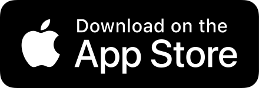
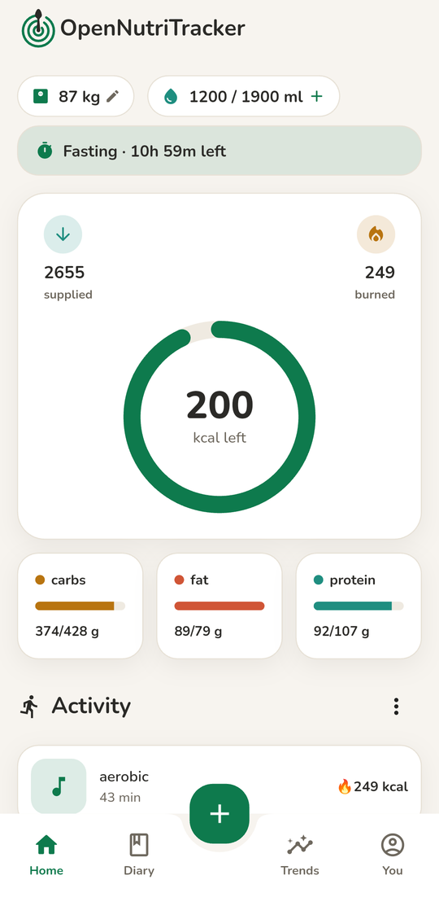
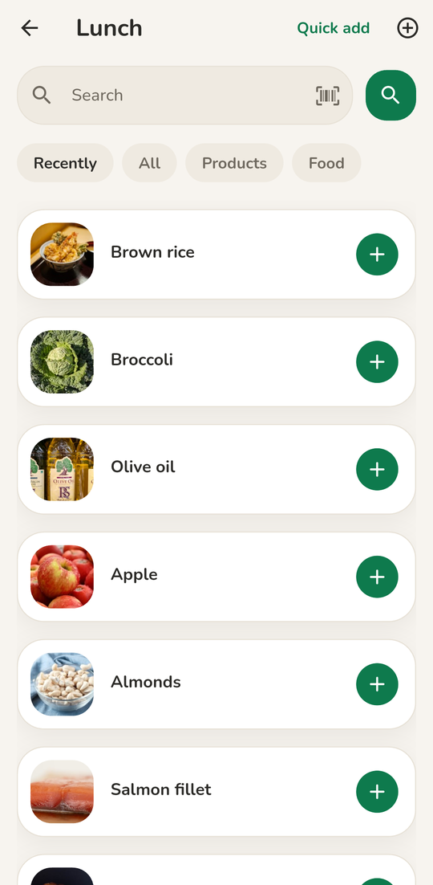
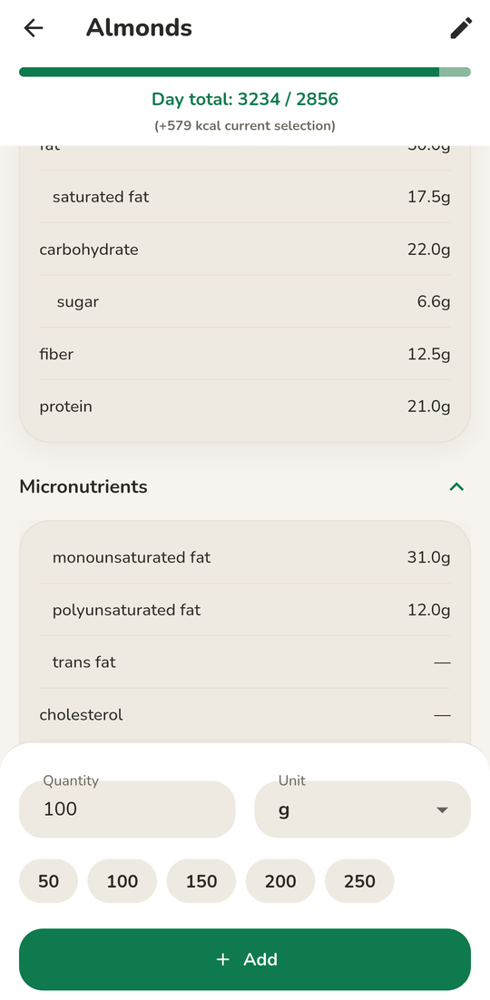
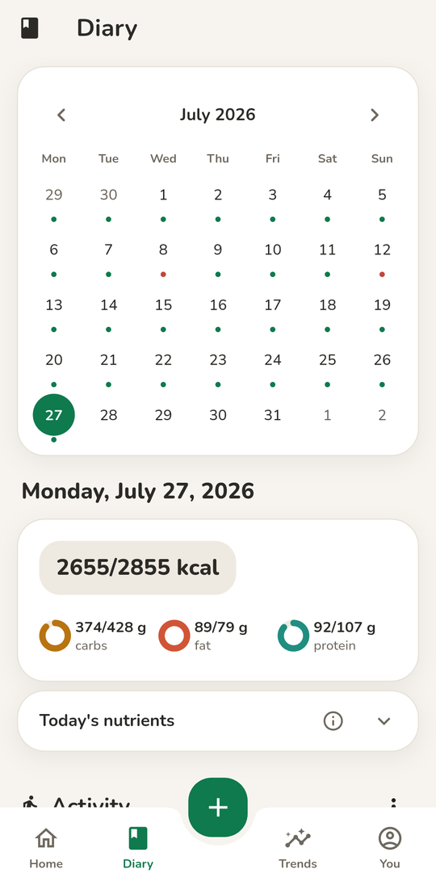
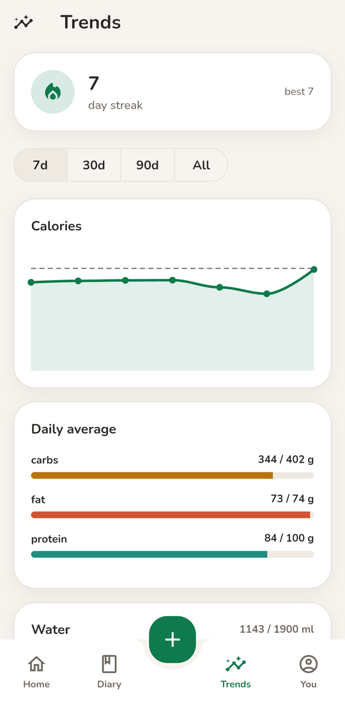
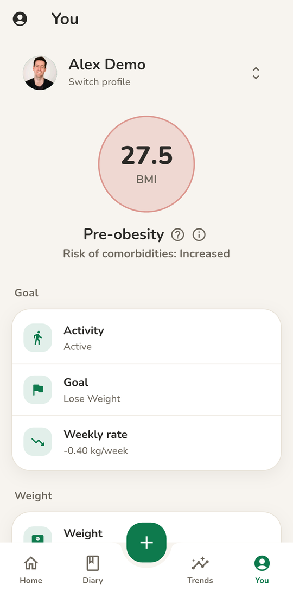

<p align="center">
  <picture>
    <source media="(prefers-color-scheme: dark)" srcset="assets/icon/ont_banner_top_light.png">
    
  </picture>
</p>

<p align="center">
  <b>Free. Open. Cited.</b><br />
  Open-source calorie, macro, and micronutrient logging for Android and iOS.
</p>

<p align="center">
  <a href="LICENSE"></a>
  <a href="https://github.com/simonoppowa/OpenNutriTracker/releases"></a>
  <a href="https://github.com/simonoppowa/OpenNutriTracker/actions/workflows/default_workflow.yml"></a>
  
  <a href="https://hosted.weblate.org/engage/opennutritracker/"></a>
  <a href="https://github.com/simonoppowa/OpenNutriTracker/stargazers"></a>
  <a href="https://github.com/simonoppowa/OpenNutriTracker/issues"></a>
  <a href="https://github.com/simonoppowa/OpenNutriTracker/pulls"></a>
</p>

<p align="center">
  <a href="https://trendshift.io/repositories/12625"></a>
  &nbsp;
  <a href="https://trendshift.io/repositories/12625"></a>
</p>

<p align="center">
  <a href="https://simonoppowa.github.io/OpenNutriTracker/">Website</a>
  ·
  <a href="GettingStarted.md">Getting started</a>
  ·
  <a href="CONTRIBUTING.md">Contributing</a>
  ·
  <a href="https://hosted.weblate.org/engage/opennutritracker/">Translate</a>
</p>

OpenNutriTracker logs what you eat and drink against a calorie and macro target it works
out from your height, weight, age, and activity level, and keeps the record on your phone.
It is for anyone who wants the numbers without handing their eating history to a company,
whether that is losing weight, gaining it, managing a condition, or simply knowing.

## Install

<p align="center">
  <a href="https://apps.apple.com/us/app/opennutritracker/id6451490901"></a>
  &nbsp;&nbsp;
  <a href="https://play.google.com/store/apps/details?id=com.opennutritracker.ont.opennutritracker"></a>
</p>

## Screenshots

<table align="center">
  <tr>
    <td align="center" width="33%"></td>
    <td align="center" width="33%"></td>
    <td align="center" width="33%"></td>
  </tr>
  <tr>
    <td align="center"><sub><b>Home</b><br />where the day stands</sub></td>
    <td align="center"><sub><b>Add food</b><br />re-log in one tap</sub></td>
    <td align="center"><sub><b>Food detail</b><br />down to the micronutrient</sub></td>
  </tr>
  <tr>
    <td align="center"></td>
    <td align="center"></td>
    <td align="center"></td>
  </tr>
  <tr>
    <td align="center"><sub><b>Diary</b><br />every day you've logged</sub></td>
    <td align="center"><sub><b>Trends</b><br />calories against your goal</sub></td>
    <td align="center"><sub><b>You</b><br />goals and body metrics</sub></td>
  </tr>
</table>

<sub>Screenshots show a demo profile with generated data.</sub>

## Why OpenNutriTracker

|  | |
| :-- | :-- |
| **Cited** | Calorie targets follow IOM 2005, BMI follows WHO, macros follow WHO TRS 916, activity burn follows the 2024 Compendium. The in-app Sources & References screen links every paper ([`sources_screen.dart`](lib/core/presentation/sources_screen.dart)). |
| **Careful** | The fasting timer opens with a content warning linking BEAT and NEDA, and "Not for me" is a first-class answer ([`fasting_warning_dialog.dart`](lib/features/fasting/presentation/widgets/fasting_warning_dialog.dart)). No streak guilt, and no notification you didn't ask for. The daily reminder is off until you enable it. |
| **Free** | No paid tier and no ads, with zero advertising or analytics SDKs in [`pubspec.yaml`](pubspec.yaml) to add them with. That includes the micronutrient panel the big-name trackers put behind a subscription. No investors, and GPLv3 leaves no exit that could paywall it later. |
| **Private** | No account to create. Your diary lives in AES-256-encrypted storage with the key held in the Android Keystore / iOS Keychain, every destination that receives a request is listed under [Privacy](#privacy) with what it's sent, and the release signing fingerprint is published so you can verify your download. |
| **Portable** | Export your diary, activities, recipes, custom meals and weight history as JSON or CSV, re-import it, or share an entry by QR. The [export format](docs/export-format.md) documents the schema and what it leaves out. |
| **Open** | Open Food Facts, USDA FoodData Central (CC0) and the German BLS (CC BY 4.0). The backend is its own open repository you can [self-host](docs/supabase-self-hosting.md). |
| **Community driven** | Over 30 developers have already contributed code, and most merged pull requests come from someone other than the maintainer. Features and fixes arrive as user issues and PRs, across the app and its food backend, and every translation is contributed on [Weblate](https://hosted.weblate.org/engage/opennutritracker/), which needs no Dart and no local setup. |
| **Inclusive** | Non-binary calorie estimation grounded in published trans-health research, nine languages, kcal or kJ, and screen-reader support treated as a bug when it breaks. |

## Key features

|  | Feature | |
| :--: | :-- | :-- |
| 🍎 | **Food logging** | Search, scan a barcode, or quick-add kcal, backed by Open Food Facts, USDA, and German BLS. |
| 📓 | **Food diary** | Breakfast, Lunch, Dinner, and Snack on a calendar, with per-meal kcal targets. |
| 📈 | **Trends** | Streaks, calories against your goal line, macro averages, water, and weight over time. |
| 🥕 | **Micronutrients** | Day and week views for ten nutrients, with optional reference-intake bars. |
| 🍽️ | **Meals and recipes** | Reusable recipes with photo, brand, and barcode. |
| 🏃 | **Activities and weight** | Workout catalogue or custom activities; weight trend against a target. |
| 💧 | **Water and fasting** | A home-screen water chip and an optional intermittent-fasting timer. |
| 🎨 | **Themes and units** | Material You accent on Android 12+, sixteen built-in themes, kcal or kJ. |
| 📤 | **Export and import** | JSON and CSV export, JSON import, and QR sharing. |

<details>
<summary>More detail on each feature</summary>

- **🍎 Nutritional tracking:** Log meals and snacks against a large food database: Open Food Facts plus a multi-source reference backend covering USDA FoodData Central and the German Bundeslebensmittelschlüssel (BLS), with the sources selectable in Settings → Food databases. Each entry can be searched, scanned, or added straight as a number when you already know the calorie cost.
- **📓 Food diary:** A calendar-driven diary that breaks the day into Breakfast, Lunch, Dinner, and Snack, with per-meal kcal targets (Standard, OMAD, Five-small, Mediterranean, Two-meal, or a custom share), drag-to-rearrange between meals, and sort by time or by macro contribution.
- **📈 Trends:** A current and best day-streak card, calories charted against your goal line, daily macro averages, water intake, and weight against target with an estimate of the weeks left to reach it. Switch the window between 7, 30 and 90 days or your whole history.
- **🥕 Micronutrient panel:** Day and week views for fibre, sodium, saturated fat, sugar, calcium, iron, potassium, vitamin D, vitamin B12, and magnesium, with optional Dietary Reference Intake bars from the IOM tables so you can see where you sit against the reference range.
- **🍽️ Custom meals + recipes:** Build a one-off custom meal or save a reusable recipe with photo, brand, and barcode. The recipe builder has its own ingredient picker with barcode scanning so you can compose meals from real products without leaving the screen.
- **⚡ Quick add:** When you already know roughly how much you ate, skip the search flow entirely. Quick add takes a title plus kcal (and optional macros) and logs it straight to the meal section.
- **📷 Barcode scanner:** Scan packaged items for instant lookup, paste a barcode manually when the camera struggles, or attach a barcode to a custom meal so future scans recognise your own foods.
- **🏃 Activities:** Log workouts from a categorised activity catalogue or define your own custom activities with direct kcal entry and reusable templates.
- **💧 Water tracker:** A water chip on the home screen with quick-add increments, an editable goal, and undo for the last entry.
- **⏱️ Fasting timer:** Optional intermittent-fasting timer with content-warning gate, a home chip showing time remaining, and a completion notification when you reach your window.
- **⚖️ Weight history:** Capture weight during onboarding and on demand, see the trend on a chart with a dashed line at your target weight, and optionally taper the calorie goal as you approach it.
- **🎨 Material You + theme picker:** Adopt the system accent colour on Android 12+, or pick from sixteen built-in presets. The app icon adapts to iOS dark and tinted appearances and to Android themed icons.
- **🔢 kcal or kJ:** Switch the energy unit globally; every diary entry, target, and chart reflects the choice.
- **📤 Export and import:** Export your diary entries, activities, tracked days, and recipes to a JSON zip, with flat CSV companions for the first three so a spreadsheet can read them ([bundle format](docs/export-format.md)). Paste a JSON blob to import meals, and share a single meal or activity as a QR code another phone can scan. Your profile, weight log, custom-meal catalogue, activity templates, water and fasting history stay out of the bundle.

</details>

## Privacy

No account, no sign-in, no analytics, no ads. Your profile, diary, activities, weight, water and fasting history, custom meals, and recipes live in local [Hive](https://pub.dev/packages/hive_ce) boxes encrypted with AES-256. The key is generated on first launch, kept in the Android Keystore / iOS Keychain, and never transmitted ([source](lib/core/utils/secure_app_storage_provider.dart)). **Settings → Delete all my data** wipes the active profile. Formal policy: [Data Protection](https://www.iubenda.com/privacy-policy/53501884).

**What leaves your device.** Three destinations, nothing else:

| Destination | When | What is sent |
| :-- | :-- | :-- |
| [Open Food Facts](https://world.openfoodfacts.org/) | Food search or barcode scan | The search term or barcode, plus a country tag from your device locale for ranking |
| Supabase reference backend | Food search | The search term |
| [Sentry](https://sentry.io) | **Only if you opt in** | Crash traces, app and OS version, device model |

[USDA FoodData Central](https://fdc.nal.usda.gov/), the German [BLS](https://www.blsdb.de), INDB and TBCA are where the food *data* comes from, not places your device talks to. Those datasets are ingested into the Supabase backend ahead of time ([self-hosting guide](docs/supabase-fdc-self-hosting.md)), so a search reaches that backend and stops there. Settings → Food databases chooses which datasets a search covers. Five are selectable today, with INDB and TBCA in the schema but not yet carrying data ([`sp_const.dart`](lib/features/add_meal/data/dto/sp/sp_const.dart)).

Requests carry a User-Agent naming the app, platform, and version, with no user or device identifier. Search results are cached locally and pruned after 90 days.

**Crash reporting** is off until you enable it, and initializes only in release builds ([`main.dart:119`](lib/main.dart:119)). `sendDefaultPii` stays `false`, so no username, email, or IP-derived identity is attached. Disabling it, or deleting your data, closes the SDK immediately.

**Permissions:** camera (barcode scanning, meal photos), photo library (meal photos, exports), notifications (daily reminder, fasting timer), internet (food lookups), and receive-boot-completed (re-registering the reminder after a reboot). No location, contacts, microphone, or health-data access.

**Not collected:** no account, email, or phone number. The backend is read with an anonymous key and there is no sign-in path. No advertising ID and no cross-app tracking: `NSPrivacyTracking` is `false` with an empty tracking-domains list, and crash and performance data are declared *not linked to the user* ([`PrivacyInfo.xcprivacy`](ios/Runner/PrivacyInfo.xcprivacy)).

<details>
<summary><b>Verifying APK signatures</b></summary>

If you are side-loading an OpenNutriTracker APK from GitHub Releases, or from F-Droid once the app is published there, you may want to confirm that the file you downloaded was signed by the same key used for every official release, rather than by someone who intercepted the download or repackaged the app.

The official SHA256 fingerprint of the Android release signing certificate is:

```
SHA256: 84:E8:60:74:EC:7E:DA:BB:10:F2:01:79:86:DD:F0:9E:53:1C:AF:7A:73:08:0A:C1:17:2B:80:C4:9C:62:08:27
```

To verify a downloaded APK against that fingerprint, run:

```sh
apksigner verify --print-certs /path/to/opennutritracker.apk
```

The `SHA-256` line in the output should match the value above exactly.

</details>

## Translations

OpenNutriTracker is translated on [Hosted Weblate](https://hosted.weblate.org/engage/opennutritracker/). Translating needs no local setup and no Dart. Pick a language, edit the strings in the browser, and Weblate syncs the result back to this repository.

<p align="center">
  <a href="https://hosted.weblate.org/engage/opennutritracker/"></a>
</p>

To start a language that isn't listed yet, request it from the [Weblate project page](https://hosted.weblate.org/projects/opennutritracker/). If you would rather work in the repository directly, the source strings live in [`lib/l10n/intl_en.arb`](lib/l10n/intl_en.arb). See [CONTRIBUTING.md](CONTRIBUTING.md) for the conventions.

## What people say

> This app has a user-friendly interface and is unburdened by the ridiculous (and constant) cash-grabbing that is chronic across health and wellness apps. As someone suffering from extreme subscription fatigue — I'm not a walking wallet! — this nutrition tracker is a breath of fresh air.

— **Ai C.**, Google Play ★★★★★

> No ads, no paywalls, no bloat, no bs. You can export your data at any moment, or import some from somewhere else, no questions asked. I have experienced no bugs in these last few months. Developers are still active on the repo, so I'm expecting it to get even better.

— **App Store review** ★★★★★

> The most recent version puts this open source nutrition tracker among the best resources out there — all while respecting your privacy through free and open source software. If you care about your fitness and care about having control of your data, look no further!

— **App Store review** ★★★★★

> Excellent simple app without ads that gets the job done. I have legit lost over 10 kg using this app.

— **Esko E.**, Google Play ★★★★★

> Simple, fast and very functional. Finally I don't have to sell my soul to MyFitnessPal ;)

— **Frederic-Leon C.**, Google Play ★★★★★

Reviews are lightly trimmed for length; the full text is on the [App Store](https://apps.apple.com/us/app/opennutritracker/id6451490901) and [Google Play](https://play.google.com/store/apps/details?id=com.opennutritracker.ont.opennutritracker) listings. Bug reports and feature requests belong in the [issue tracker](https://github.com/simonoppowa/OpenNutriTracker/issues), which gets read faster than a review does.

## Mentions

> I've got my OpenNutriTracker here, my open-source calorie counter. Support open-source apps. No ads, no subscriptions, and I don't send my data to anyone — everything stays here.

— [**Cadê a Chave?**, Ep. 1773](https://www.youtube.com/watch?v=DPLtsx-f6Ro&t=498s) (at 8:18), the vlog channel run by the team behind [Coisa de Nerd](https://www.youtube.com/@coisadenerd), one of Brazil's largest tech channels at 11M+ subscribers. Translated from the Portuguese by a contributor in [#375](https://github.com/simonoppowa/OpenNutriTracker/issues/375).

| Where | What |
| :-- | :-- |
| [Trendshift](https://trendshift.io/repositories/12625) | Ranked #2 Dart Repository of the Day |
| [It's All Widgets!](https://itsallwidgets.com/opennutritracker) | Featured in the Flutter app showcase |
| [AlternativeTo](https://alternativeto.net/software/myfitnesspal/?license=opensource) | Currently the top-ranked open-source MyFitnessPal alternative |

If you have written or talked about OpenNutriTracker somewhere, open an issue or a pull request and it can go on this list.

## Contributing

Issues and pull requests are welcome. See [CONTRIBUTING.md](CONTRIBUTING.md) for the project's conventions, including the requirement to target the `develop` branch and the steps for adding localized strings.

Built with Flutter and Dart, following a clean-architecture split (data / domain / presentation) with `flutter_bloc` for state, `get_it` for dependency injection, and encrypted `hive_ce` boxes for local storage. [AGENTS.md](AGENTS.md) is the full architecture and conventions reference.

**Getting started:** see [GettingStarted.md](GettingStarted.md) for setting up a local build.

**Data export format:** the export bundle (Settings → Export / Import App Data → Export) is documented at [`docs/export-format.md`](docs/export-format.md), covering both the JSON schema and the CSV companion the import / export round-trip uses.

**Food database backend:** the multi-source food database lives in its own repository, [OpenNutriTracker-Backend](https://github.com/simonoppowa/OpenNutriTracker-Backend), which holds the schema, import pipeline, and translation tooling. Self-hosting it and pointing a local build at your own Supabase project is documented at [`docs/supabase-self-hosting.md`](docs/supabase-self-hosting.md).

Thanks to all the contributors:

<a href="https://github.com/simonoppowa/OpenNutriTracker/graphs/contributors">

</a>

## Disclaimer

> [!WARNING]
> OpenNutriTracker is not a medical application. All data provided is not validated and
> should be used with caution. Please maintain a healthy lifestyle and consult a
> professional if you have any problems. Use during illness, pregnancy or lactation is
> not recommended.

> [!NOTE]
> The application is still under construction. Errors, bugs and crashes might occur.

## Acknowledgments

The food database used in OpenNutriTracker is powered by [Open Food Facts](https://world.openfoodfacts.org/) together with a multi-source reference backend hosted in Supabase: [USDA FoodData Central](https://fdc.nal.usda.gov/) (CC0) and the [Bundeslebensmittelschlüssel](https://www.blsdb.de) 4.0 (CC BY 4.0, © Max Rubner-Institut), with the [Anuvaad INDB](https://anuvaad.org.in) (CC BY 4.0) and [TBCA Brazil](https://www.tbca.net.br) (USP/FoRC) prepared as future sources. The schema and import pipeline live in the [OpenNutriTracker-Backend](https://github.com/simonoppowa/OpenNutriTracker-Backend) repository; self-hosting is documented in [`docs/supabase-self-hosting.md`](docs/supabase-self-hosting.md).

Dietary Reference Intake values for the micronutrient panel come from the U.S. National Academies' Institute of Medicine tables. The in-app Sources & References screen (one tap from the home calorie ring or the profile BMI card) lists the peer-reviewed sources used for energy needs, BMI classification, macro distribution, MET activity calories, and non-binary calorie estimation.

## License

This project is licensed under the GNU General Public License v3.0. See the [LICENSE](LICENSE) file for more information.

## Contact

For questions, suggestions, or collaborations, contact the maintainer:

**Simon Oppowa**

- GitHub: [@simonoppowa](https://github.com/simonoppowa)
- Email: [opennutritracker-dev@pm.me](mailto:opennutritracker-dev@pm.me)
