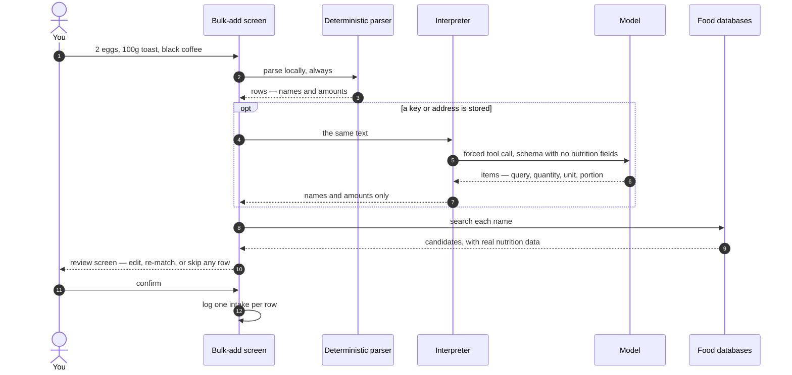
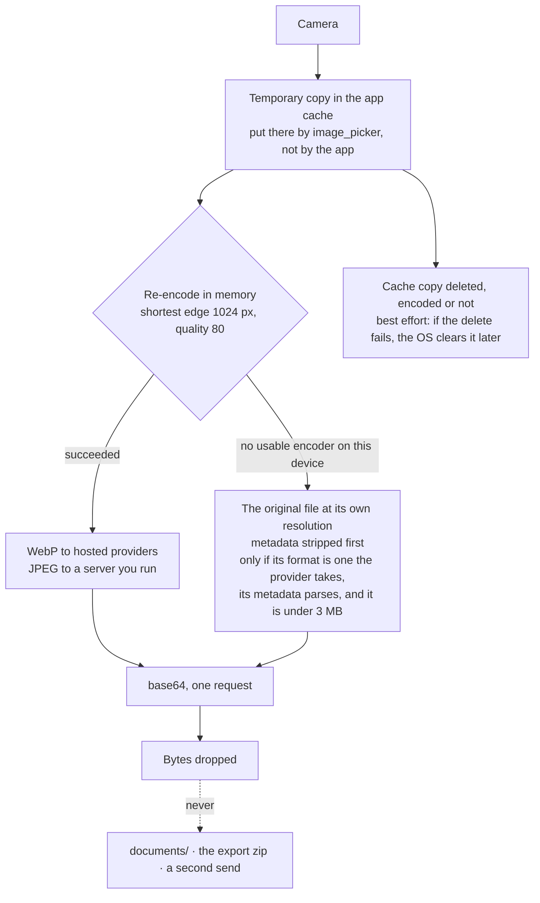
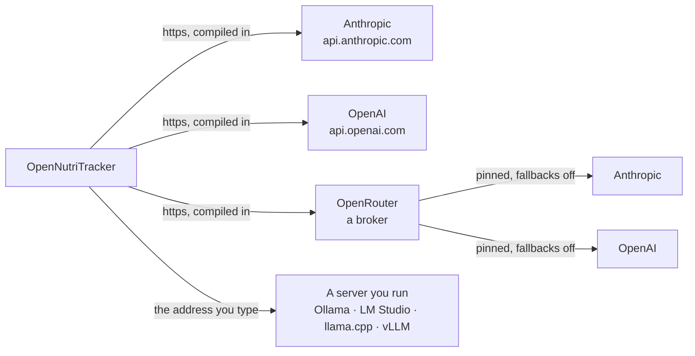
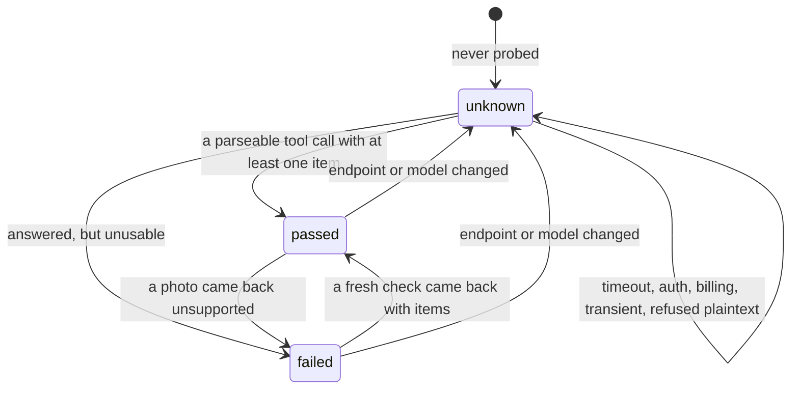

# AI Meal Assistance

This page documents **how the optional AI meal-logging feature works** — what happens between
typing a meal and seeing it in your diary, where a request goes, and what the app refuses to do.

It is the companion to the README's [Privacy](../README.md#privacy) section. The README holds the
**promise**: which destinations exist, what each one keeps, and what the Experimental label means.
This page holds the **mechanism**. Where the two touch, the README is authoritative.

The feature is **off until you enable it**, and enabling it means supplying your own API key or
the address of a server you run. The project operates no inference of its own, holds no key, and
pays no provider.

## Table of contents

1. [The one rule that shapes everything](#the-one-rule-that-shapes-everything)
2. [A typed meal, end to end](#a-typed-meal-end-to-end)
3. [A photo, end to end](#a-photo-end-to-end)
4. [Where a request goes](#where-a-request-goes)
5. [Choosing a provider](#choosing-a-provider)
6. [A server you run: the probe](#a-server-you-run-the-probe)
7. [The guardrails](#the-guardrails)
8. [What it deliberately does not do](#what-it-deliberately-does-not-do)
9. [Code map](#code-map)

---

## The one rule that shapes everything

**A model is never allowed to tell the app a nutrition number.**

This is the opposite of what most people expect from an "AI food logger", so it is worth stating
plainly. The model's entire job is to read *"2 eggs, 100g toast, black coffee"* — or a photograph
of the same — and answer with **food names and amounts**. Nothing else. Every calorie, every gram
of protein, every microgram of vitamin B12 is then looked up in the same food databases the app
has always used: Open Food Facts, USDA FoodData Central, the German BLS.

So the app's older claim — *every number is cited* — survives the feature intact. The model
changes how a food is **found**, never what it **contains**.

The rule is enforced structurally rather than by convention. The schema every provider is held to
is a single top-level constant with no nutrition fields in it, so adding a provider cannot
introduce a second schema:

```dart
/// The schema every provider is held to. **No nutrition fields, by construction.**
/// ...
/// **The app never relies on provider-side constrained decoding.** This schema is
/// a hint to the model; [_mealItemFrom] and `validateParsedMealItems` are the
/// enforcement. ... a reply carrying a `calories` field loses it whether or not
/// any provider agreed to forbid one.
const mealItemsToolSchema = { ... };
```
— [`meal_items_api.dart`](../lib/features/add_meal/domain/meal_items_api.dart)

The second half matters as much as the first. Some providers offer "strict" or constrained
decoding that would guarantee the reply matches the schema. The app does not rely on it. Every
guarantee is re-checked in Dart against a reply that ignored the schema entirely — because a
guarantee you cannot verify locally is a guarantee held by somebody else.

The permitted fields are exactly four: `query` (the food name, in your language), and optionally
`quantity`, `unit` — the latter constrained to a fixed list — and `portion`. That list includes
`l`, `kg` and `lb` for a measured reason recorded in the source: omitting them did not stop the
model answering, it made the model map a litre onto `ml` and keep the number, turning 1.5 l of milk
into 1.5 ml. A thousandfold undercount that nothing flagged, because a unit *had* been stated.

Adding them opened the failure on the other side: a model answering with a unit nobody typed.
*"ein Glas Milch"* states no amount at all — Anthropic answered `1 l`, OpenAI answered
`unit: "Glas"`, and which of the two wrong answers hurt was decided by what the enum happened to
spell. The litre was recognised, multiplied by a thousand, and logged as 470 kcal for a glass of
milk; `Glas` was dropped as unrecognised and came out right.

**So a unit in a reply is now corroborated against the text the model was given.**
`textStatesAUnit` runs the parser's own segmentation and extraction over that text and asks
whether any segment carries a number with a unit against it. If none does, every unit in the
batch is dropped — before the kg/l conversion, because after it `1 l` is already 1000 ml and the
number cannot be put back. The quantities survive, so each row arrives as a bare count, which the
review screen resolves against the food's own serving: that is how the `Glas` answer reaches the
right figure today, by being unrecognised rather than by being right.

It reuses the parser rather than scanning for the symbols because `l` occurs inside `Glas`, so a
substring test would report a unit in exactly the phrase this exists to catch. And it asks the
question of the whole input rather than of each row, because a model's rows do not map onto the
input's segments reliably enough to ask per row — *"100g Toast, 2 Eier"* states a unit, so nothing
in that batch is touched. Only the typed path corroborates: a photograph states nothing, and the
photo path's counts-only rule already drops every unit it gets.

`portion` is a word, never a number — the schema says so in as many words: *"A word only, never a
weight or a count."* It is a lookup key into the matched food's own portion list ("slice", "cup"),
so the gram weight still comes from the database row, and a key matching nothing is ignored. It
earns its place on the photo path, where there is no typed text for a portion word to be found in.

## A typed meal, end to end



Two things in that diagram are load-bearing.

**The parser runs first, and it runs unconditionally.** `parseMealText` is deterministic, local,
and has no idea a model exists. If the model answers, its rows are used; if it fails for any
reason — no key, no network, a rejected credential, a rate limit, a changed API — the parser's
rows are used instead and the user lands on exactly the experience they had before the feature
existed. As the source puts it: *the model is an improvement to a working feature, never a
dependency of it.*

An empty answer is an exception to that, and deliberately so. A model returning zero items is
saying *there is no food here*, which is an answer, not a failure — so it is honoured. The
alternative was measured on a Pixel 6: the parser will turn any sentence into a search, and
*"meine Steuererklärung und ein Tacker"* came back as a cheese-roll match the user had to dismiss.

**A reply with no usable items is not that answer.** Entries are read one at a time and one
carrying no `query` is dropped, so a single bad entry does not cost the good ones. A reply where
*every* entry drops is refused outright rather than passed on as an empty list — it would
otherwise reach the screen wearing the same clothes as a deliberate "there is no food here", and
the user would get neither the model's rows, which never existed, nor the parser's, which that
judgement had suppressed.

That refusal is transient, and so is a body that will not decode, an `items` that is not an array,
and arguments that are not JSON: nothing about one garbled reply says the next one will be. A
reply with no tool call in it at all is the exception and lands on `unsupported` instead, because
a model that answers in prose will answer in prose again. On the typed path a transient failure
means the parser's rows, with no notice and not even the read-by-AI banner — the screen the user
would have had with the feature switched off. On the photo path there is nothing underneath, so
it becomes the one line the screen has for it: *Couldn't read the photo. Check your connection and
try again.* Right for the common cause of a transient failure, and wrong for this one.

**Being cut off is not a case the app recognises.** The answer is capped at 1024 tokens, which is
roomy for a short list of short strings and short enough that a runaway is stopped early, and no
client reads the flag a provider sets when that cap is reached. A truncated reply is therefore
judged only on whether what arrived still parses: losing a closing brace makes it malformed and
lands it with everything above, while a partial list that parses is believed as though it were the
whole answer.

**None of the three clients puts what you typed, or your photograph, into a log or an error
string.** A socket error can carry the request URL and, on some platforms, part of the payload,
so the caught error is dropped and a fixed reason thrown in its place, and an ordinary failure
reaches the log as a status code. One path above them is narrower: an interpreter that throws
something no client constructs is a bug, and the use case logs that object and its stack trace
before falling back to the parser.

Not every failure is worth interrupting for. `auth`, `unsupported`, `billing`, `timeout` and
`insecureDestination` produce a notice, because they are permanent until something changes — a
mistyped key that fails silently forever is a bad afternoon, and it was found exactly that way on
a device. A dropped connection or a rate limit produces nothing, because a notice that fires for
blips is a notice people learn to ignore.

**What travels with a request is a short list, and it is the same list every time.** The model id
you picked; the system prompt; the line you typed, with the surrounding whitespace off; the tool —
its name, its one-line description and the schema above — together with the instruction to call
it; and the cap on the answer. That is the whole body. Two destinations add a field of their own
and neither is about you: OpenAI is told `store: false`, and OpenRouter is given the routing block
that pins the vendor and refuses providers that would train on what they are sent.

The system prompt is about two hundred words, and it is rules rather than data: one entry per
food, `query` is the food name alone in the language you wrote in, an amount only where you stated
one, never converted between units, and an empty list when the input holds no food. Your app
language is appended to it as a single sentence — *The user's app language is "de"* — and that is
the bare language code, with no region and nothing else about the device it came from.

**Nothing else is attached, and there is nowhere for it to be attached.** Not a diary entry, a
past meal, a goal, a weight, an age or anything else from your profile; not an earlier request or
its reply, since each one stands alone; and no identifier for you, your install or your device.
Each client builds its body out of exactly two things it was handed, the prompt and what you are
asking about, and the headers the app sets are the credential, the content type, and — depending
on the destination — Anthropic's API version or OpenRouter's metadata opt-in. OpenRouter's
attribution headers are deliberately not among them: they would put the app on a public
leaderboard as a side effect of somebody saving a key. A photo request differs only where it has
to, in its own prompt and a picture in place of the line.

## A photo, end to end

Reading a photo is the same feature with a camera instead of a keyboard, offered once a key or
address is enabled — and, for a server you run, only once the setup probe's photo leg has passed
against the address and model currently configured. Nothing vouches for your own server the way a
curated list vouches for a hosted one, so the app's own check stands in; a camera button missing
here is that verdict, not a bug. What differs is that a photo has **nothing underneath it** — there is no
offline way to turn a picture into food names — so a failure here is reported rather than
absorbed.



The cache deletion is there because of a measurement, not a theory. `image_picker` does not hand
back the original file — it copies the chosen photo into the app's cache directory and never
cleans up. Verified on a Pixel 6: after one pick, the full JPEG was still sitting in `cache/`,
byte for byte. That copy is what would make *"the app keeps no photo"* false, so the app removes
it, in a `finally` that runs whether the encode succeeded, failed or threw.

**The delete is best effort, and worth stating as such.** A cache file the app could not remove is
not worth failing someone's meal entry over, so the failure is swallowed and the copy sits there
until the OS clears the cache. That is a narrower promise than "the file is gone the moment the
request leaves", and the narrower one is the true one.

**One branch sends more than the encoding above describes.** If the device has no usable encoder
for the chosen container, the app falls back to sending the picked file at its own resolution
rather than failing over an encoder the user has no way to install — so what leaves the device on
that path is the camera's own output, not a 1024 px re-encode. Its metadata is stripped first, EXIF
above all: a phone geotags by default, and the app asks for no location permission. Three
conditions bound it: the file's format must be one the provider accepts, its metadata blocks must
parse — bytes the app cannot account for are refused rather than forwarded — and it must be under
3 MB, or nothing is sent at all. The fallback is far rarer on the JPEG path than the WebP one, because JPEG encoders are
universal where WebP's are not.

The photo is never written to the documents directory, which is what the export zip reads — so a
meal photo sent for interpretation is not in your export and cannot be shown again.

The container differs per destination for a measured reason: llama.cpp decodes with `stb_image`,
whose format list has no WebP. All four common local runtimes decode JPEG, so choosing JPEG for a
server you run removes the incompatibility rather than detecting it. Quality and pixel size are
identical either way.

**What comes back from a photo may be a count, never a measurement.** The text path can carry
`100 g` because you typed it; a photograph states nothing, so a gram figure read off a plate is
an estimate wearing the shape of something measured. The prompt asks for counts only, and the
interpreter drops any amount that came with a unit or is not a whole number — the number along
with it. Keeping the bare number is the worse failure: an estimated `200 g` of rice stripped to
`200` reads downstream as a count, and a count against a food whose serving can be scaled is
logged as 200 servings. The row falls back to the amount an unquantified item gets, and you set
it. The rule sits in the shared photo interpreter rather than in a client, so a provider added
later inherits it.

## Where a request goes



**OpenRouter is a broker, so a request there touches two parties**: OpenRouter, and the vendor
that actually serves the model. That shape is the reason every curated OpenRouter model is pinned
to the vendor named beside it in Settings, with fallbacks off. Unpinned, a request for
`anthropic/claude-haiku-4.5` was answered by Amazon Bedrock on every attempt of a three-run probe
— a vendor the user never chose and the screen never named.

**What crosses on that path is more than the payload.** The disclosure shown before an OpenRouter
key is stored says that OpenRouter forwards an account-level identity to the serving vendor on
every request, and that this cannot be switched off — so the vendor sees a stable handle for your
account next to the meal, not an anonymous request. That is OpenRouter's behaviour, not the app's:
nothing here turns it off, and nothing here can check that it happens. It is in the consent text
because it changes what "the vendor keeps what it receives" is worth.

The app's own addition to that request is one header, and it is not an identity.
`x-openrouter-metadata: enabled` opts the *reply* into naming the vendor that actually served the
request — a per-request opt-in, so it has to ride on every call — and it is the only way the pin
above can be checked at runtime instead of asserted. A mismatch is logged and nothing more: the
reply is still a valid answer to the question asked, and losing someone's meal entry over a
routing discrepancy would be the worse outcome.

Three of the four destinations are compiled-in `https://` URLs and cannot be redirected. The
fourth is an address you supply, and there plaintext is the ordinary case rather than an edge one:
the field's own example is `http://192.168.1.5:11434`, and the dialog carries a separate
disclosure sentence for an unencrypted address precisely because that is what people save. So the
guard is not deciding *whether* plaintext happens but *where it may go* — see
[the guardrails](#the-guardrails).

**Two requests reach a server you run before any meal does.** One is the setup check described
[below](#a-server-you-run-the-probe), which OK starts. The other is a `GET` to `/v1/models` on
the address in the field, asked so the model box can offer a picker instead of a blank line.
Exactly two things ask for it: committing a changed address — moving off the field, or the
keyboard's own done key — and the *Load models* button. Opening the dialog asks nothing,
switching to this provider asks nothing, no timer asks, and coming back to a configured server
and leaving the address alone asks nothing.

**The model list is the one request that goes out before you have agreed to anything.** The
consent screen is reached from OK, on the path that writes a credential, and the fetch hangs
off the address field instead — so on a first-time setup your server has already been asked
what it serves by the time that screen appears. The request carries an `Authorization` header
when a key is available, and a key typed into the dialog counts before OK commits it, because a
reverse proxy in front of a local runtime will want one. The plaintext guard covers it like any
other request, so a public `http://` address is refused rather than asked.

The consent screen names both requests before you agree, and it is shown once for the whole
feature — so someone who agreed while setting up a hosted provider does not see that paragraph
again when they later point the app at a server of their own. The three hosted providers are
sent nothing until you read a meal: their model lists are compiled in, so there is nothing to
ask them for.

Most of what each destination *keeps* is a policy question rather than a mechanism one, and it
lives in the README's [Privacy](../README.md#privacy) section — but two of the four requests carry
a retention instruction of their own. The direct OpenAI call sends `store: false`, because
the Responses API retains request and response content by default, so saying nothing is not the
same as opting out. The OpenRouter routing block sends
`data_collection: "deny"` alongside the vendor pin, which makes a vendor that stores input
non-transiently ineligible to serve the request at all. Two things there are worth knowing before you
read this page's diagrams as reassurance: being reached directly is not the same as keeping less,
and on the broker path the two retention policies **stack**.

### What the request itself asks for

Two of the four requests carry a retention instruction of their own, and both are worth naming
because in each case the provider's default is the opposite.

**Every request to OpenAI carries `store: false`.** The Responses API stores by default, so the
field is not a no-op — omitting it would leave each meal line, and each photograph, sitting in the
account's stored responses.

**Every request through OpenRouter carries `data_collection: 'deny'`** inside its routing block.
OpenRouter's routing default is `allow`, which makes providers that store input non-transiently
and may train on it eligible to serve the request. It is sent as a policy field rather than
inferred from the model slug, because free *usage* is what triggers those clauses and not the
`:free` suffix — a slug check would look like enforcement and would not be it.

Anthropic gets no such field, and a server you run gets no routing block at all: asserting
`data_collection: 'deny'` to a machine in your own house is a claim the app cannot mean.

The app also **withholds OpenRouter's two attribution headers**. `HTTP-Referer` and `X-Title` put
the app on OpenRouter's public leaderboard, and saving a key is not consent to being listed there.

## Choosing a provider

Four providers, differing along two axes that do not line up:

| | Reached | Credential | Model |
|---|---|---|---|
| **Anthropic** | directly | API key | curated list |
| **OpenAI** | directly | API key | curated list |
| **OpenRouter** | via a broker, then a vendor | API key | curated list, each vendor-pinned |
| **A server you run** | directly, at your address | address; key optional | whatever the server offers |

The odd one out is the fourth, and it is odd in a way that reached deep into the code: its
credential is an **address**, not a key, and a key is optional. Everything that had previously
treated *"has a key"* as the test of whether the feature is usable had to learn a broader
question.

Keys are stored **per provider** in the platform keystore, so switching from one to another and
back does not mean finding a credential again. A pointer records which provider is active, and it
is read strictly:

- **Nothing stored** reads as Anthropic. Before providers existed every key was an Anthropic key,
  so an existing install is already correct and no migration has to run.
- **A name this build does not recognise** reads as *nothing usable* — not as a default. If a
  newer build wrote a provider name and the user then downgraded, reading that as Anthropic would
  silently redirect their requests to a company they did not choose. In an app that enumerates its
  destinations as a guarantee, that is the one failure that cannot be quiet.

**Choosing the wire client** is a single `switch` in one function, [`mealItemsApiFor`](../lib/features/add_meal/data/meal_items_api_factory.dart).
The interpreters take a client and never learn which one they were handed, because the prompt and
the schema never depended on the destination — so nothing in the request path branches on provider
a second time.

That is narrower than "adding a provider is one edit", and deliberately so. Four other exhaustive
switches ask a provider to answer a question of their own, and each of them will refuse to compile
until a new member answers it:

| Switch | The question it makes a new provider answer |
|---|---|
| [`meal_photo_encoder.dart`](../lib/features/add_meal/util/meal_photo_encoder.dart) | which image container this destination can actually decode |
| [`ai_model_catalogue.dart`](../lib/core/utils/ai_model_catalogue.dart) | which models are offered, and which vendor serves each |
| [`ai_assist_dialog.dart`](../lib/features/settings/presentation/widgets/ai_assist_dialog.dart) | what this provider is called on screen |
| [`bulk_add_screen.dart`](../lib/features/add_meal/presentation/screens/bulk_add_screen.dart) | what the photo disclosure says before a picture is sent |

None of them has a `default`. The photo encoder says why in its own source: a fifth provider has to
answer the question rather than inherit whichever answer a wildcard happened to give it. For a
feature whose whole claim is that it enumerates its destinations, a silent default is the failure
mode worth spending four compile errors to prevent.

**Timeouts differ by an order of magnitude, on purpose.** The hosted three get 20 seconds. A
server you run gets 120. That is not a guess: a real Ollama on an M4 Mac mini serving an 8B model
was measured at 22–24 seconds from cold and 8–17 warm, and Ollama unloads after five idle minutes
by default — so *"the first request of the meal"* is the ordinary case, not an edge one. The
margin is generous because the measurement came from the fast end of the hardware range this
provider exists to serve.

## A server you run: the probe

When you point the app at your own server, it cannot know what that server can do. So it asks — at
setup, and again each time you confirm that dialog, because the address and the model can be
identical and the machine behind them different — by sending a fixed example line and a photograph that ships with the app
through the shipping code path:
the same prompts, the same schema, the same forcing mode, the same image encoder. A probe built
from its own request would be testing a second implementation that nothing else uses.


**Neither of those is yours.** The line is `two eggs and a slice of toast`, in English whatever
your locale, because the bar is structural — did a parseable tool call come back with at least
one item — and nothing about that depends on the words. The photograph is one of the demo
images the app already ships for Try Demo: a sliced loaf on a board, one unambiguous food
filling the frame, picked over the tempura bowl and the garnished yoghurt because either
would make a correct answer look like a wrong one. It is written to a temporary file and run
through the same encoder your own photo would go through, and deleted the same way. The consent
screen puts it in those words before you agree: a fixed example line and a sample photograph of
ours, never anything of yours.

The verdict has three states, and the third is the interesting one.



**A timeout does not mean the endpoint failed.** It means the app stopped waiting. Recording that
as `failed` would hide a working camera; recording an unproven guess as `passed` would offer a
dead end. So every ambiguous outcome lands on `unknown`, and only two failure kinds are conclusive
enough to close a capability: `unsupported` (nothing on the other end can serve this kind of
request) and `rejected` (the provider refused the request itself — on the photo leg that means the
picture, which will be refused again tomorrow). A refusal by the app's own plaintext guard is not
one of these: nothing was sent, so nothing was learned, and it lands on `unknown` like a timeout.

A stored `passed` is a fact about one `(endpoint, model)` pair, and it can stop being true without
the user touching anything — pull a different model under the same tag and the camera is still
offered, still claims photos work, and fails on every photograph. So a photo that comes back `unsupported` retracts the stored photo pass, and only that one. The
text verdict is left where it stands: a photograph says nothing about whether a meal line
still reads. The text path retracts nothing at all, in either row, because a typed meal that
fails still has the offline parser underneath it and there is no capability to withdraw. Only that one failure kind: the network, the load,
the credential and the bill say nothing about whether a model has eyes.

Changing the address or the model discards the record entirely, so a stored verdict can only ever
describe the configuration currently in place.


**`failed` is not a dead end either.** *Check this server* re-runs both legs from Settings
without a re-save, and a conclusive verdict overwrites a stored one in both directions — so
pulling a model that can actually see, and checking again, turns the photo row back to a pass.
Only a conclusive one: an inconclusive result leaves whatever was known alone, which is what
stops a retry against a sleeping server revoking a pass that is still true.

The probe runs its two legs **sequentially** — a local runtime serves one request at a time
against one loaded model, so firing both at once would only queue them. That makes the worst case
two full timeouts long. The wait quoted to you in Settings is derived from that number rather than
written beside it, rounded up, because a second hardcoded figure is a second thing to forget when
the timeout moves.

## The guardrails

Independent checks, not a sequence. Each one is pinned by a test that fails if it stops holding.

| Gate | What it stops | Enforced in | Pinned by |
|---|---|---|---|
| Schema with no nutrition fields | a model supplying a calorie count | [`meal_items_api.dart`](../lib/features/add_meal/domain/meal_items_api.dart) | [`openrouter_meal_items_api_test.dart`](../test/unit_test/openrouter_meal_items_api_test.dart) — *the schema exposes only query, quantity, unit and portion* |
| Dart-side re-validation | a reply that ignored the schema | [`meal_text_parser.dart`](../lib/features/add_meal/util/meal_text_parser.dart) | [`meal_text_parser_test.dart`](../test/unit_test/meal_text_parser_test.dart) |
| Counts only from a photo | an amount nobody stated arriving as if somebody had | [`model_meal_photo_interpreter.dart`](../lib/features/add_meal/data/model_meal_photo_interpreter.dart) | [`model_meal_photo_interpreter_test.dart`](../test/unit_test/model_meal_photo_interpreter_test.dart) — *a measured amount loses both its unit and its number*; *a fractional amount is not a count, so it goes too* |
| Payload never logged by a client | the meal you typed, or a photo, reaching a log or an error string from a failed send | all three clients | contract test — *a failing send puts the payload in neither the error nor the log*; *a photo never reaches the error or the log either* |
| Response body withheld on rejection | a provider's error text carrying your content back into a log | all three clients | contract test — *a rejected request does not carry the response body* |
| Consent before storage | a credential stored, or used, before you agreed to what leaving the device means | [`ai_assist_dialog.dart`](../lib/features/settings/presentation/widgets/ai_assist_dialog.dart), [`ai_consent_screen.dart`](../lib/features/settings/presentation/widgets/ai_consent_screen.dart), [`ai_credential_storage.dart`](../lib/core/utils/ai_credential_storage.dart) | [`ai_assist_dialog_test.dart`](../test/features/settings/presentation/ai_assist_dialog_test.dart), [`ai_credential_storage_test.dart`](../test/unit_test/ai_credential_storage_test.dart) — *a credential without an agreement is not usable* |
| Plaintext destination guard | `http://` to anywhere that is not private | [`plaintext_destination_guard.dart`](../lib/core/utils/plaintext_destination_guard.dart) | [`plaintext_destination_guard_test.dart`](../test/unit_test/plaintext_destination_guard_test.dart) |
| Address pinning after lookup | DNS answering differently the second time | same file | same test |
| Vendor pin, fallbacks off | OpenRouter serving from a vendor the screen never named | [`meal_items_api_factory.dart`](../lib/features/add_meal/data/meal_items_api_factory.dart) | [`meal_items_api_factory_test.dart`](../test/unit_test/meal_items_api_factory_test.dart) |
| Data collection denied on the broker path | OpenRouter routing to a vendor that may keep your meal and train on it | [`openai_compatible_meal_items_api.dart`](../lib/features/add_meal/data/openai_compatible_meal_items_api.dart) | [`openrouter_meal_items_api_test.dart`](../test/unit_test/openrouter_meal_items_api_test.dart) — *refuses providers that may keep and train on the input* |
| Per-provider credential slots | a key reaching a provider it was not issued for | [`ai_credential_storage.dart`](../lib/core/utils/ai_credential_storage.dart) | [`ai_credential_storage_test.dart`](../test/unit_test/ai_credential_storage_test.dart) |
| Unrecognised provider tag refuses to send | a downgraded build redirecting requests to a vendor you did not pick | same file | same test |
| Connection budget | a request hanging indefinitely | all clients | contract test — *a stalled connection gives up instead of hanging* |

**The plaintext guard deserves a note**, because it is the only one enforcing something the
platform does not. `http://ollama.lan` is what people actually configure, and a name resolves
wherever DNS says — possibly somewhere public, and possibly somewhere different today than when it
was saved. Neither platform's transport-security policy reaches Dart's socket layer, so this check
is the whole of the enforcement. It permits loopback, link-local, RFC 1918 and IPv6 unique-local,
and it deliberately excludes carrier-grade NAT (`100.64.0.0/10`) — which is what Tailscale hands
out, so a tailnet user must use `https://`. The app cannot tell a tailnet from an ISP's shared
address space, and treating every `100.x` as private would quietly permit plaintext onto a
carrier's network.

That the platform does not enforce this was measured rather than assumed. `dart:io` opens BSD
sockets, so a request never passes through NSURLSession or Android's HTTP stacks, and neither iOS
App Transport Security nor Android's cleartext policy ever sees it. Which is why neither platform
file says anything about it: there is no `usesCleartextTraffic` attribute in the manifest and no
`NSAppTransportSecurity` dictionary in `Info.plist`, and adding either would change nothing.

Both address families are checked. A measured dual-stack case shows why: a home server whose
reverse lookup gave `192.168.1.46` had a **forward lookup returning only a public-scope IPv6
address**. An IPv4-only check would never have seen where the connection actually went.

## What it deliberately does not do

- **No inference the project runs, and no key the project holds.** You bring a credential or an
  address. The project pays nothing and is not in the request path.
- **No nutrition number from a model**, ever — see [the one rule](#the-one-rule-that-shapes-everything).
- **No on-device model.** The local tier is a deterministic parser, not a small model.
- **No photo kept.** Not in the documents directory, not in an export, not for a retry.
- **No silent provider substitution.** A provider name this build does not recognise refuses to
  send rather than falling back to a default.
- **Not on by default.** The feature is inert until a credential is stored, and it carries an
  Experimental label whose exit criteria are stated in the README.

## Code map

| File | Responsibility |
|---|---|
| [`meal_items_api.dart`](../lib/features/add_meal/domain/meal_items_api.dart) | The schema, the tool contract, and reading `items` back |
| [`meal_text_interpreter.dart`](../lib/features/add_meal/domain/meal_text_interpreter.dart) | What "read this text" means, independent of provider |
| [`meal_photo_interpreter.dart`](../lib/features/add_meal/domain/meal_photo_interpreter.dart) | The same for a photograph |
| [`meal_interpreter_exception.dart`](../lib/features/add_meal/domain/meal_interpreter_exception.dart) | The failure kinds every client classifies into |
| [`anthropic_meal_items_api.dart`](../lib/features/add_meal/data/anthropic_meal_items_api.dart) | Anthropic Messages wire format |
| [`openai_meal_items_api.dart`](../lib/features/add_meal/data/openai_meal_items_api.dart) | OpenAI Responses wire format |
| [`openai_compatible_meal_items_api.dart`](../lib/features/add_meal/data/openai_compatible_meal_items_api.dart) | Chat-completions format — serves OpenRouter and your own server |
| [`meal_items_api_factory.dart`](../lib/features/add_meal/data/meal_items_api_factory.dart) | The whole of provider selection, plus per-provider timeouts |
| [`model_meal_text_interpreter.dart`](../lib/features/add_meal/data/model_meal_text_interpreter.dart) | Prompt and locale handling for text |
| [`model_meal_photo_interpreter.dart`](../lib/features/add_meal/data/model_meal_photo_interpreter.dart) | The same for photos |
| [`read_meal_text_usecase.dart`](../lib/features/add_meal/domain/usecase/read_meal_text_usecase.dart) | Model-or-parser policy, and which failures are worth reporting |
| [`read_meal_photo_usecase.dart`](../lib/features/add_meal/domain/usecase/read_meal_photo_usecase.dart) | The same for photos, plus retracting a stale photo pass |
| [`probe_ai_endpoint_usecase.dart`](../lib/features/add_meal/domain/usecase/probe_ai_endpoint_usecase.dart) | Running the two setup probes and ruling on each |
| [`run_ai_endpoint_probe_usecase.dart`](../lib/features/add_meal/domain/usecase/run_ai_endpoint_probe_usecase.dart) | Probing and storing the verdict together |
| [`meal_text_parser.dart`](../lib/features/add_meal/util/meal_text_parser.dart) | The deterministic parser, and the bounds every row is held to |
| [`meal_photo_encoder.dart`](../lib/features/add_meal/util/meal_photo_encoder.dart) | 1024 px / q80 encoding, per-destination container, cache cleanup |
| [`ai_credential_storage.dart`](../lib/core/utils/ai_credential_storage.dart) | Per-provider keys, addresses, model choice, probe records, and the recorded agreement |
| [`ai_model_catalogue.dart`](../lib/core/utils/ai_model_catalogue.dart) | The curated lists and their vendor pins |
| [`ai_model_list_api.dart`](../lib/core/utils/ai_model_list_api.dart) | Asking your own server which models it has |
| [`plaintext_destination_guard.dart`](../lib/core/utils/plaintext_destination_guard.dart) | Whether an unencrypted request may leave, and to which address |
| [`ai_assist_dialog.dart`](../lib/features/settings/presentation/widgets/ai_assist_dialog.dart) | The Settings surface: provider, credential, model, probe |
| [`ai_consent_screen.dart`](../lib/features/settings/presentation/widgets/ai_consent_screen.dart) | The disclosure shown before a credential is stored |
| [`ai_assist_summary.dart`](../lib/core/presentation/ai_assist_summary.dart) | The one-line state shown on the Settings tile |
| [`onboarding_other_options_page_body.dart`](../lib/features/onboarding/presentation/widgets/onboarding_other_options_page_body.dart) | The same dialog during first-run onboarding, writing as it goes rather than when onboarding finishes |
| [`bulk_add_screen.dart`](../lib/features/add_meal/presentation/screens/bulk_add_screen.dart) | Input, the review rows, and logging them |
| [`bulk_add_bloc.dart`](../lib/features/add_meal/presentation/bloc/bulk_add_bloc.dart) | Screen state |
| [`bulk_add_state.dart`](../lib/features/add_meal/presentation/bloc/bulk_add_state.dart) | Rows, flags, and what a row is missing |
| [`bulk_add_event.dart`](../lib/features/add_meal/presentation/bloc/bulk_add_event.dart) | What the screen can be asked to do |

---

> **Where the privacy claims live.** What each destination receives and how long it keeps it is in
> the README's [Privacy](../README.md#privacy) section, kept there so it is reviewed alongside the
> code that makes it true. This page describes mechanism and links to it rather than restating it.
